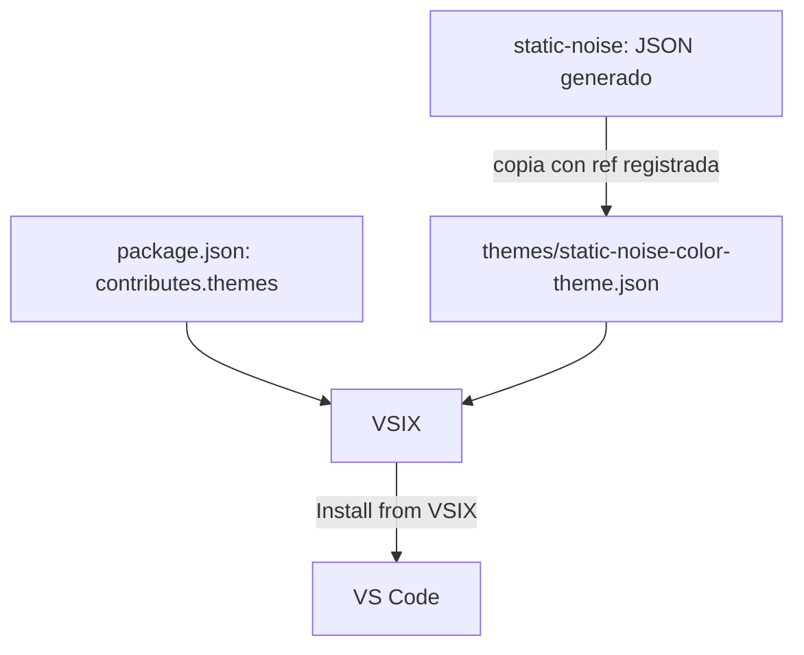

# Static Noise Manual VSIX Theme - Plan

## Goal Capsule

- **Objective:** Las personas que usen VS Code pueden instalar manualmente Static Noise como extensión desde un archivo VSIX y activarlo como tema oscuro.
- **Means:** El repositorio consume el JSON de VS Code ya generado y versionado en `hcastillaq/static-noise`; no recompila la paleta ni la plantilla. (KTD1)
- **Authority:** Las decisiones de alcance de esta sesión y el JSON de VS Code del upstream prevalecen sobre cualquier ajuste local de color.
- **Execution profile:** El trabajo es principalmente de empaquetado; priorizar pruebas de empaquetado e instalación real sobre pruebas unitarias.
- **Stop conditions:** Detenerse si el upstream no puede proporcionar un archivo JSON versionado e identificable, o si VS Code no reconoce el VSIX como un tema instalable.

---

## Product Contract

### Summary

Este plan crea una extensión mínima de VS Code que distribuye el tema generado por Static Noise en un VSIX instalable manualmente. El paquete no publica en Visual Studio Marketplace ni Open VSX durante esta iteración.

### Problem Frame

Static Noise ya genera y versiona `dist/vscode/static-noise-color-theme.json`, pero ese archivo no es todavía una extensión que VS Code pueda instalar. El consumidor necesita un manifiesto, activos de extensión y un artefacto VSIX, sin crear una segunda fuente de verdad para la paleta.

### Requirements

**Tema y procedencia**

- R1. La extensión incluye un tema oscuro denominado Static Noise que apunta al JSON generado por el repositorio upstream.
- R2. La extensión conserva la procedencia del JSON con la versión de Static Noise, el SHA completo e inmutable del commit y la ruta upstream usada para obtenerlo.
- R3. La primera iteración no modifica valores de color, no introduce una plantilla local y no añade `semanticTokenColors`.

**Instalación manual**

- R4. Un mantenedor puede producir un archivo VSIX local y una persona puede instalarlo mediante la opción “Install from VSIX…” de VS Code.
- R5. El README explica la instalación local, activación del tema y actualización mediante un VSIX nuevo.

### Acceptance Examples

- AE1. Dado un VSIX generado desde el repositorio, cuando una persona lo instala en VS Code y selecciona el tema, entonces ve los colores de interfaz y TextMate definidos por Static Noise.
- AE2. Dado que Static Noise actualiza su JSON de VS Code, cuando el mantenedor reemplaza el artefacto consumidor, actualiza su procedencia e incrementa la versión de la extensión, entonces el siguiente VSIX contiene exactamente ese JSON y actualiza la instalación previa.

### Scope Boundaries

- No publicar en Visual Studio Marketplace ni Open VSX.
- No crear variantes Void, Soft o de alto contraste.
- No añadir `semanticTokenColors`; esa mejora pertenece a `hcastillaq/static-noise`.
- No compilar `palette.json` ni `templates/vscode.json.template` dentro de este repositorio.

### Success Criteria

- El VSIX se genera sin errores de manifiesto y se instala en una copia limpia de VS Code.
- El JSON del paquete coincide byte a byte con el JSON upstream identificado en la documentación de procedencia.

---

## Planning Contract

### Key Technical Decisions

- KTD1. **Consumir el artefacto upstream generado.** Copiar `dist/vscode/static-noise-color-theme.json` desde un commit SHA identificable de `hcastillaq/static-noise` a `themes/static-noise-color-theme.json`; el consumidor no ejecuta el compilador de paleta. (session-settled: user-directed — chosen over recompilar la paleta localmente: el consumidor solo debe empaquetar el JSON ya generado.)
- KTD2. **Versionar el tema empaquetado.** Mantener el JSON dentro de `themes/` para que la revisión y el VSIX incluyan una salida estática sin depender de Node al instalar el tema.
- KTD3. **Empaquetar solo para distribución manual.** Usar `@vscode/vsce` para crear el VSIX localmente, sin credenciales, publisher verificado ni flujos de publicación.
- KTD4. **Mantener el contrato sintáctico actual.** Preservar los `tokenColors` TextMate y el campo `semanticHighlighting` del JSON upstream; no añadir reglas semánticas locales. (Governs R3)

### High-Level Technical Design

El upstream es dueño de la paleta y del JSON. Este repositorio declara cómo VS Code lo descubre y empaqueta el conjunto para instalación manual.

### Sequencing

U1 establece el manifiesto y la estructura de extensión. U2 incorpora el artefacto upstream y su procedencia. U3 limita el contenido distribuido y documenta la instalación. U4 verifica el VSIX y el comportamiento en VS Code.

### Risks & Dependencies

- La actualización depende de que `hcastillaq/static-noise` mantenga versionado `dist/vscode/static-noise-color-theme.json`.
- El flujo manual exige que el mantenedor cree y distribuya un VSIX nuevo por cada actualización.
- La primera versión necesita un icono PNG propio o un activo permitido por el empaquetador.

---

## Implementation Units

### U1. Create the extension manifest

- **Goal:** Definir el paquete como una extensión de tema oscuro que VS Code pueda descubrir.
- **Requirements:** R1, R4.
- **Dependencies:** None.
- **Files:** `package.json`, `.gitignore`.
- **Approach:** Añadir los metadatos mínimos de extensión, incluida una versión inicial, el requisito de versión de VS Code y una entrada `contributes.themes` que apunte a `themes/static-noise-color-theme.json`; incluir una dependencia de desarrollo para el empaquetador, un script dedicado a crear el VSIX y una validación previa que compruebe que cada ruta de tema declarada existe, sin script de compilación de tema.
- **Execution note:** Es configuración de empaquetado; tras incorporar el tema en U2, validar el manifiesto y empaquetar una prueba.
- **Patterns to follow:** La estructura de contribución de temas de la documentación oficial de VS Code.
- **Test scenarios:**
  - Ejecutar la validación previa con una ruta de tema inválida y comprobar que falla antes de producir una salida utilizable.
- **Verification:** El manifiesto declara Static Noise y la validación previa rechaza rutas de tema inexistentes.

### U2. Vendor the generated Static Noise theme

- **Goal:** Incorporar el JSON upstream sin transformar sus colores ni reglas sintácticas.
- **Requirements:** R1, R2, R3, AE2.
- **Dependencies:** U1.
- **Files:** `themes/static-noise-color-theme.json`, `UPSTREAM.md`.
- **Approach:** Copiar el archivo generado desde `dist/vscode/static-noise-color-theme.json` de un commit upstream explícito. Registrar en `UPSTREAM.md` el repositorio, la versión si existe, el SHA completo del commit y la ruta origen; el archivo bajo `themes/` es una copia distribuible, no una fuente editable. Al actualizar el artefacto, incrementar también la versión de la extensión en `package.json`.
- **Execution note:** Comparar el contenido de origen y destino antes de empaquetar; una diferencia solo es válida cuando se actualizan la procedencia registrada y la versión de la extensión.
- **Patterns to follow:** `palette.json`, `templates/vscode.json.template` y `src/build.js` son propiedad del upstream y se leen solo para verificar procedencia, no se copian como una segunda cadena de build.
- **Test scenarios:**
  - Ejecutar el empaquetado con el tema incorporado y comprobar que se produce un único VSIX.
  - Comparar byte a byte el JSON de `themes/` con el JSON obtenido del SHA completo registrado en `UPSTREAM.md`.
  - Al actualizar el JSON upstream, comprobar que también se incrementa la versión de la extensión.
  - Analizar el JSON para comprobar que es válido y conserva `tokenColors`.
  - Confirmar que no aparece una sección local `semanticTokenColors` añadida por el consumidor.
- **Verification:** La procedencia es legible, el JSON empaquetado coincide con el upstream señalado y el manifiesto con el tema incorporado se empaqueta correctamente.

### U3. Define the manual-distribution boundary

- **Goal:** Entregar un VSIX pequeño y una guía suficiente para instalar y actualizar el tema sin registros públicos.
- **Requirements:** R4, R5.
- **Dependencies:** U1, U2.
- **Files:** `package.json`, `.vscodeignore`, `README.md`, `LICENSE`, `icon.png`.
- **Approach:** Declarar `icon.png` en el manifiesto. Excluir del VSIX los archivos de Git, documentación de desarrollo y dependencias no necesarias en tiempo de instalación. Documentar cómo obtener el VSIX, instalarlo desde VS Code, seleccionar Static Noise y reemplazarlo al recibir una actualización; aclarar que no se publica en registros durante esta iteración.
- **Execution note:** Tratar el VSIX como el entregable; revisar su lista de archivos antes de distribuirlo.
- **Patterns to follow:** Las restricciones de empaquetado de extensiones VS Code, incluido el uso de PNG para el icono cuando se declara uno.
- **Test scenarios:**
  - Inspeccionar el VSIX y comprobar que contiene el manifiesto, el tema, la licencia, el README y el icono, sin `node_modules` ni archivos de desarrollo.
  - Seguir el README desde una instalación limpia y comprobar que no requiere Marketplace ni credenciales.
- **Verification:** La documentación y el contenido del paquete describen y sostienen el mismo flujo manual.

### U4. Verify installation and theme activation

- **Goal:** Probar la ruta que seguirá la persona que recibe el VSIX.
- **Requirements:** R1, R4, R5, AE1.
- **Dependencies:** U1, U2, U3.
- **Files:** `README.md`.
- **Approach:** Instalar el VSIX en un perfil o entorno limpio de VS Code, activar Static Noise desde el selector de temas y comprobar los colores de workbench, terminal y sintaxis TextMate visibles. Registrar cualquier paso indispensable en el README.
- **Execution note:** Es una comprobación de humo de empaquetado e instalación, no una batería de pruebas unitarias.
- **Patterns to follow:** El flujo de instalación manual documentado por VS Code.
- **Test scenarios:**
  - Instalar un VSIX válido y confirmar que Static Noise aparece en el selector de temas.
  - Activar el tema y comprobar fondo del editor, barra lateral, terminal y resaltado de comentarios, palabras clave, strings y tipos.
  - Intentar instalar un VSIX incompleto o corrupto y comprobar que VS Code lo rechaza sin registrar un tema funcional.
- **Verification:** AE1 se cumple en un entorno limpio y el README contiene los pasos realmente necesarios.

---

## Verification Contract

| Area | Evidence of completion |
|---|---|
| Theme source | El JSON bajo `themes/` coincide con el SHA documentado en `UPSTREAM.md`. |
| Package | El empaquetador genera un VSIX sin errores ni advertencias bloqueantes. |
| Package contents | La inspección del VSIX confirma que no incluye dependencias ni fuentes de desarrollo innecesarias. |
| Manual install | Una instalación limpia reconoce Static Noise y permite activarlo. |
| Theme behavior | La interfaz, terminal y scopes TextMate coinciden visualmente con el JSON upstream. |

---

## Definition of Done

- U1-U4 cumplen sus verificaciones.
- El repositorio contiene un JSON de tema de procedencia documentada y sin modificaciones locales de paleta.
- El VSIX puede entregarse e instalarse manualmente sin publicar en ningún registro.
- El README explica instalación, activación y actualización manual.
- No quedan archivos de experimentos, artefactos temporales o un segundo compilador de paleta en el cambio.

---

## Sources / Research

- Upstream: https://github.com/hcastillaq/static-noise — `palette.json`, `templates/vscode.json.template`, `src/build.js` y `dist/vscode/static-noise-color-theme.json`.
- VS Code theme guide: https://code.visualstudio.com/api/extension-guides/color-theme
- VS Code publishing and VSIX packaging: https://code.visualstudio.com/api/working-with-extensions/publishing-extension
